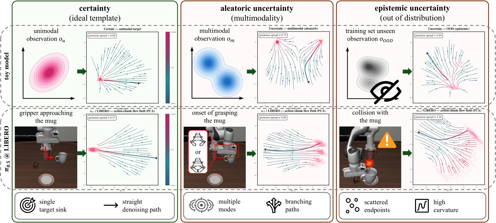
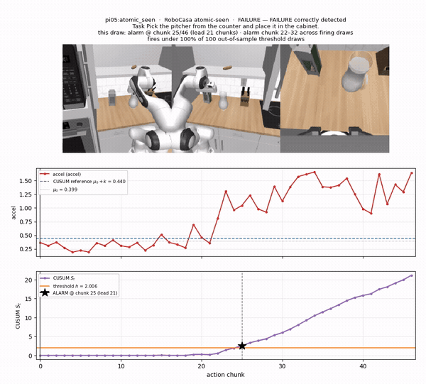
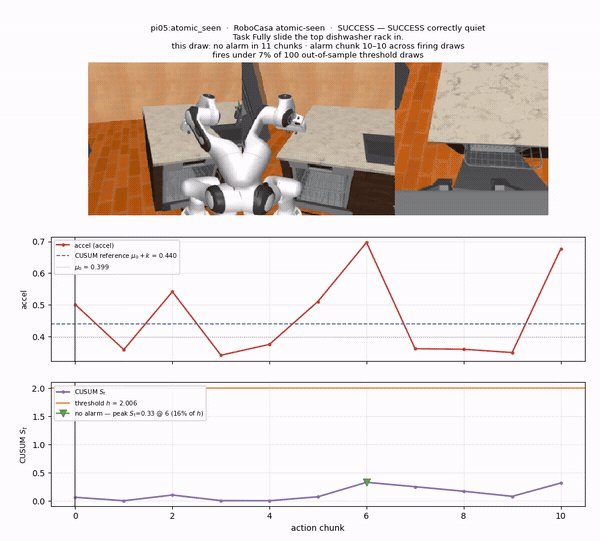

# The Geometric Nature and a Free Proxy for Flow-Matching Uncertainty

[](https://arxiv.org/abs/2607.27933)

> *There is a goal, but no way; what we call the way is hesitation.*
>
> — Franz Kafka, *The Zürau Aphorisms*

<p align="center">
  
</p>

<p align="center">
  <em>Certainty gives a single sink and a straight denoising path; multimodality branches; OOD scatters
  the endpoints and bends the path. <code>accel</code> reads that curvature off the path for free.</em>
  <br>
  <sub>Vector version: <a href="assets/fm_field.pdf">assets/fm_field.pdf</a></sub>
</p>

Reference implementation of **`accel`** (denoising acceleration), a cost-free uncertainty proxy
for flow-matching policies.

## Demo — the detector running online

`accel` per action chunk (top) driving CUSUM against a conformal threshold (bottom), on π₀.₅ /
RoboCasa Atomic-Seen. The alarm fires from the free geometric score alone.

<table>
  <tr>
    <td width="50%"></td>
    <td width="50%"></td>
  </tr>
  <tr>
    <td align="center"><sub><b>failure caught early</b> — alarm at chunk 25/46, <b>21 chunks of lead</b><br><a href="assets/video%201.mp4">mp4</a></sub></td>
    <td align="center"><sub><b>success stays quiet</b> — no alarm, peak <i>S<sub>t</sub></i> at 16% of threshold<br><a href="assets/video%202.mp4">mp4</a></sub></td>
  </tr>
</table>

```
record the denoise path  ──►  read accel / Straightness  ──►  CUSUM + split conformal  ──►  alarm
   (free, during eval)          (free, post-hoc)               (calibrated on successes)
                          └──►  resample K chunks  ──►  D_resample     (expensive; the ground
                                (validation only)                       truth accel stands in for)
```

## Install

```bash
pip install -e .                  # analysis only: numpy / scipy / matplotlib / tqdm
pip install -e '.[learned]'       # + torch, for the learned baselines (rnd_oe / logpzo / safe)
pip install -e '.[all]'           # + lerobot & gymnasium, to record new rollouts
```

Producing a *new* recording also needs the LIBERO benchmark, see
[`docs/reproduce.md`](docs/reproduce.md).

## Quickstart — toy FM model, ~2 min, no GPU, no data

```bash
python experiments/flowfield_toy.py --device cpu
```

Trains one 2-D conditional flow net (225k parameters) on a ring of observations whose action
targets are unimodal and multimodal then draws the learned field. Because the toy's posterior is known by construction, this is the controlled version of our central claim.

## The full pipeline

```bash
# 1. record — closed-loop LIBERO eval, capturing every Euler iterate + the exact conditioning.
#    --disable-compile is REQUIRED: torch.compile captures the graph before the hooks fire.
python cli/eval.py --model pi05 --dataset libero --task-group libero_object \
    --record-fm --record-context --disable-compile --run-id my-run

# 2. ground truth — resample K=32 chunks at each decision's own observation.
#    Gated on bitwise reproduction of the recorded chunk: a drifted observation would measure
#    a posterior the policy never faced, so the stage refuses rather than approximates.
python cli/divergence.py --run my-run --samples 32 --first-actions 10

# 3. the free scores + Table 1 — accel, Straightness, and the pooled rank correlation.
python cli/geometry.py --run my-run
python experiments/prefix_rho.py --run my-run --label "pi05 - LIBERO-Object"

# 4. capture stages the learned baselines need (GPU; skip if only scoring accel/Straightness).
#    Args: <python> <run-path> <shard-id> <n-shards> <first-actions>
bash experiments/fd_gpu_stages.sh python outputs/runs/my-run 0 1 10

# 5. Table 2 — the detector battery, CUSUM + split conformal, 5 repeats.
python experiments/failure_detection.py score --cell pi05:libero_all --device cuda
python experiments/failure_detection.py aggregate
```

Every stage writes into one self-describing run directory and records itself in its `run.json`; see
[`outputs/README.md`](outputs/README.md) for the layout and [`docs/formats.md`](docs/formats.md)
for the on-disk recording format.

## Layout

```
fmaccel/
  recording/    FM trajectory capture during eval + a numpy-only reader
  geometry/     accel (Algorithm 1), Straightness, the denoise-phase profile   [no policy needed]
  posterior/    resample the K-chunk posterior — the ground truth              [needs the policy]
  detectors/    14 detectors behind a lazy registry
  detection/    scoring, CUSUM + conformal calibration, GPU capture stages
  models/       the pi05 adapter (the extension point for other policies)
  datasets/     the LIBERO adapter
  toy/          the 2-D flow net for the flow-field figure
cli/            one thin wrapper per pipeline stage
experiments/    the paper's tables and figures
docs/           method, formats, reproduce
```

The split that matters: `geometry/`, `detectors/`, `detection/score`, `detection/cusum` and
`recording/loader` are **numpy-only and import without a policy installed**. Only recording and
resampling need the model. That is what makes the scores free — they are read off an artifact, not
computed by a second forward pass.

## Docs

- [`docs/reproduce.md`](docs/reproduce.md) — commands per experiment, and the paper's published
  numbers to compare against.
- [`docs/method.md`](docs/method.md) — the estimators, the calibration, and the toy configuration,
  each mapped to the code.
- [`docs/formats.md`](docs/formats.md) — the on-disk recording format.

## License

Apache-2.0. See [`LICENSE`](LICENSE).
